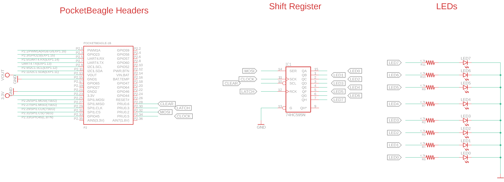

# 74HC595_RPmsg
This code  takes the user input from a userspace code and sends it to the PRU
using RPMSG and then the PRU pushes the data inside the shift register. 

## Wiring the 74HC595 shift register

## Firmware
To build the PRU firmware:

	cd 74HC595_RPmsg
	make

## Remoteproc host driver

Build and install firmware:

	sudo cp out/pru-core0.elf /lib/firmware/am335x-pru1-fw
	sudo cp out/pru-core1.elf /lib/firmware/am335x-pru0-fw
	sync

In order to see the blinking led when you press the button you'll need to configure the pin mux:

	sudo config-pin P2.34 pruout
	sudo config-pin P2.32 pruout
	sudo config-pin P2.30 pruout
	sudo config-pin P2.28 pruout

change the pin numbers as per your usage

## Upload the code to PRU cores
	
	cd /sys/class/remoteproc/remotepoc1
	echo start > state
	
	cd /sys/class/remoteproc/remoteproc2
	echo start > state

## Build and Send Data from userspace:
	cd userspace_code
	gcc UserSpace_Data.c -o UserSpace_Data.out

In order to change the value change the string  from "123" to desired decimal no between 0-255
