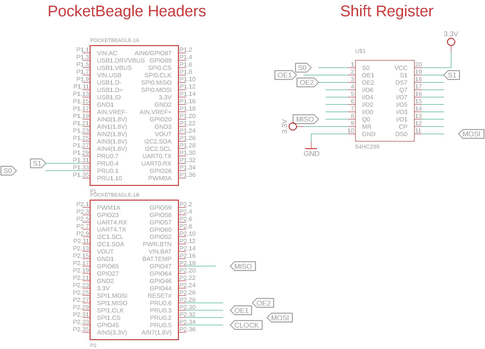

# 74HC299-BidirectionalBus
This code can configure 74HC299 in SIPO or PISO mode and reads or writes from the internal register inside the chip.

## <u>Connect and Test Circuit</u>

### Wiring diagram 

### Configure Overlays

	sudo nano /boot/uEnv.txt
	
As shown in the image uncomment the overlays to enable remoteproc and disable UiO.

### Configure Enhanced PRU pins

	cd hardwaretest_299/pru_pinconfig
	chmod +x PRUconfig.sh
	./PRUconfig.sh
In order to configure pins automatically on boot refer to README in pru_pinconfig folder
### Build and Install the firmware to test the connections
	
	cd hardwaretest_299
	make
	make install_PRU0

### Result	

If alternate LEDs connected to I/O-0 to I/O7 glows. This means the connections are OK. and everything is configured.

## <u>Rpmsg Based Communication between the PRU and ARM</u>

To do a bidirectional communication we need gpiochip driver and userspace code.

### Build and insert Driver
	
	cd driver
	make
	sudo insmod gpiochip.ko
	
### Build the userspace code
	
	cd uspace_examples
	make
	
### Test Bidirectional Communication

Before proceeding further. Make sure you have inserted the gpiochip driver and have connected the 74hc299 correctly to the PRU as shown in the diagram. Run the code as following:
	
	./write_multibits 

**Result:** You should see the alternate LEDs connected to shift registers glowing. The shift register is in SIPO mode.Fiddle around with the code to change the pattern

Next in order to  test input connect a button to I/O-0 of shift register.On my hardware test my button is connected such that when it is not pressed the pin is pulled low. when button is pressed it pulls the pin HIGH.
	
	./read_onelineauto

**Result:** You should see in dmesg and on your terminal that the bit no 1 is 0 and all other bits are 1.The shift register is in PISO mode.
	
### Debugging Tips

- If you see following error while executing userspace code "Open chip failed.Please check the gpiolib number in /dev"

	ls -l /dev | grep gpio
 
 	change the chipname pointer variable value if required.
 
- If the LEDs are not glowing at all

  Please check if the ground of beagleboard, shift registers are connected together.
  
  Also use a multimeter in continutiy mode to test if all the wires are connected properly. Check the voltages on shift register VCC. If still any issue. Please raise a issue.
  
 
  

 
 

	
