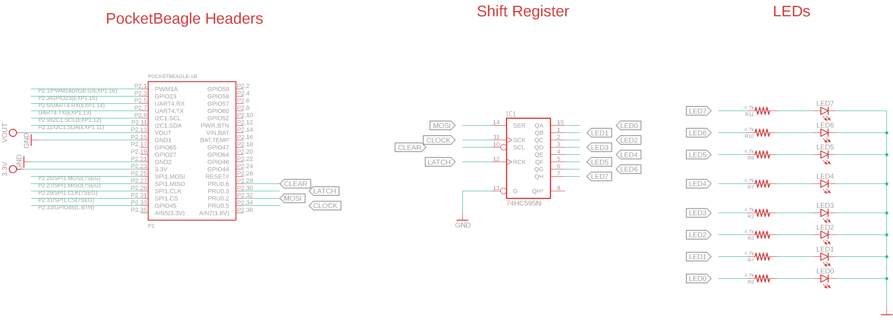

# 74HC299-BidirectionalBus
This code can configure 74HC299 in SIPO or PISO mode and reads or writes from the internal register inside the chip.

## <u>Connect and Test Circuit</u>

### Wiring diagram 

### Configure Overlays

	sudo nano /boot/uEnv.txt
	
As shown in the image uncomment the overlays to enable remoteproc and disable UiO.

### Configure Enhanced PRU pins

	cd hardwaretest_299/pru_pinconfig
	chmod +x PRUconfig.sh
	./PRUconfig.sh
In order to configure pins automatically on boot refer to README in pru_pinconfig folder
### Build and Install the firmware to test the connections
	
	cd hardwaretest_299
	make
	make install_PRU0

### Result	

If alternate LEDs connected to I/O-0 to I/O7 glows. This means the connections are OK. and everything is configured.

## <u>Rpmsg Based Communication between the PRU and ARM</u>

To do a bidirectional communication we need gpiochip driver and userspace code.

### Build and insert Driver
	
	cd driver
	make
	sudo insmod gpiochip.ko
	
### Build the userspace code
	
	cd uspace_examples
	make
	
### Test Bidirectional Communication
	./gpiochip_multibit
If everything works fine you should see  the LEDs connected to the output glow in a specific pattern. To change the pattern change the values array.

	./gpiochip_multibitinput
If everything works fine you should see  that all the pins are read as High. Connect the buttons to the inputs of shift register . Now  execute the script next time you should see a 0 for the bit positions. On pressing a button and executing the code  you should see the corresponding bit being high. The connection for the button are as below.
	
### Debugging Tips

- If you see following error while executing userspace code "Open chip failed.Please check the gpiolib number in /dev"

	ls -l /dev | grep gpio
 
 	change the chipname pointer variable value if required.
 
- If the LEDs are not glowing at all

  Please check if the ground of beagleboard, shift registers are connected together.

 
 

	